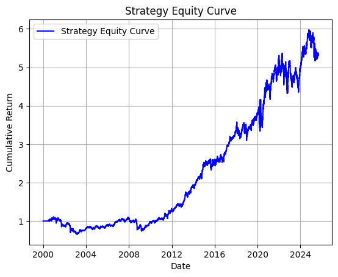
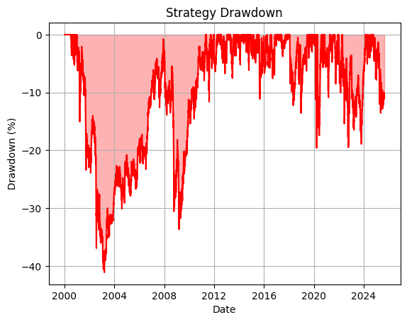

# Adaptive Eigenportfolio Construction

[](https://python.org)

## 1. Project Summary

This project provides a complete Python implementation of a quantitative portfolio construction strategy based on a robust, statistically denoised risk model. The methodology uses **Random Matrix Theory (RMT)** to filter noise from the asset covariance matrix, a technique designed to improve the stability and out-of-sample performance of portfolio optimisation. The final portfolio is constructed according to the **Global Minimum Variance (GMV)** framework, using the denoised covariance matrix as its core input. The strategy's parameters are re-estimated daily on a 63-day rolling window to adapt to changing market conditions.

---

## 2. Key Features

* **Robust Statistical Estimation:** Implements **Ledoit-Wolf shrinkage** to compute a well-conditioned and stable estimate of the sample covariance matrix, mitigating issues from high dimensionality.
* **Principled Signal-Noise Separation:** Employs Random Matrix Theory, specifically the **Marchenko-Pastur law**, to objectively separate eigenvalues corresponding to true market signals from those representing statistical noise.
* **Numerically Stable Reconstruction:** Utilises a trace-preserving method to re-inject noise variance back into the filtered matrix, guaranteeing the final risk model is both positive-definite and invertible.
* **Classic Portfolio Optimisation:** Constructs a **Global Minimum Variance (GMV)** portfolio, providing a disciplined, risk-focused approach to asset allocation that does not rely on forecasting returns.

---

## 3. Results & Performance Analysis

A backtest was performed on a universe of **9 US sector ETFs** (XLE, XLF, XLK, etc.) using daily adjusted close data from **January 1, 2000, to September 1st, 2025**. The simulation yielded a **Sharpe Ratio of 0.46** and a **maximum drawdown of -41.1%**.

The full analysis can be executed via the accompanying Jupyter Notebook: `run_backtest.ipynb`.

<table>
  <tr>
    <td></td>
    <td></td>
  </tr>
  <tr align="center">
    <td><em>Strategy Equity Curve</em></td>
    <td><em>Strategy Drawdown (%)</em></td>
  </tr>
</table>

---

## 4. Quantitative Methodology

The strategy is built on a rigorous, multi-stage mathematical pipeline that is executed on a rolling basis for each day of the backtest.

### Stage 1: Robust Covariance Estimation (Ledoit-Wolf Shrinkage)
The standard **Sample Covariance Matrix (SCM)** is a notoriously noisy estimator. To counter this, we first compute a shrunk estimate, $\hat{\Sigma}_{\text{shrunk}}$, which is a structured blend of the SCM and a stable prior (the constant correlation matrix). This provides a more robust starting point for analysis:

$$
\hat{\Sigma}_{\text{shrunk}} = (1 - \delta^{\*}) S + \delta^{\*} F
$$

### Stage 2: Signal-Noise Separation (Random Matrix Theory)
We perform an eigendecomposition on $\hat{\Sigma}\_{\text{shrunk}}$ and use the Marchenko–Pastur theorem from RMT to separate signal from noise. This theorem provides a theoretical upper bound, $\lambda_{+}$, for eigenvalues of a purely random matrix. Any empirical eigenvalue larger than this bound is classified as a "signal" representing a persistent market structure:

$$
\lambda_{+} = \sigma^{2}\left(1 + \frac{1}{\sqrt{q}}\right)^{2}
$$

### Stage 3: Denoised Covariance Reconstruction
A denoised covariance matrix is constructed using only the identified signal components. To ensure the final matrix is invertible, the average variance of the discarded noise eigenvalues, $\bar{\lambda}_{\text{noise}}$, is re-injected into the orthogonal noise subspace:

$$
\hat{\Sigma}_{\text{final}} = V_{k}\Lambda_{k}V_{k}^{T} + \bar{\lambda}_{\text{noise}}\left(I - V_{k}V_{k}^{T}\right)
$$

### Stage 4: Global Minimum Variance Portfolio Construction
Using the final denoised risk model, $\hat{\Sigma}_{\text{final}}$, we solve for the vector of portfolio weights $W^{*}$ that minimizes portfolio variance, subject to a full investment constraint:

$$
W^{*} = \frac{\hat{\Sigma}_{\text{final}}^{-1}\mathbf{1}}
{\mathbf{1}^{T}\hat{\Sigma}_{\text{final}}^{-1}\mathbf{1}}
$$

---

## 5. Technical Architecture & Design

The project is structured with a focus on separating the strategy logic from the backtesting engine.

* `strategy.py`: Encapsulates the core quantitative logic. This class is responsible for the entire mathematical pipeline, from fetching data and calculating log returns to performing the **RMT denoising** and computing the final **GMV weights**.
* `backtester.py`: Contains the core simulation engine. It is strategy-agnostic, handling the daily event loop, calling the strategy for signals, calculating portfolio returns, and computing final performance metrics.
* `run_backtest.ipynb`: A Jupyter Notebook that serves as the main script to configure and run the backtesting simulation and visualise the final results, including the equity curve and drawdown charts.

---

## 6. Critical Analysis & Future Improvements

While this project successfully implements a sophisticated risk-based strategy, further research could address its inherent limitations:

* **Model Assumption Limitations:** The entire methodology relies on a rolling window, which assumes that the statistical properties of returns are relatively stable (stationary) within that lookback period. However, financial markets exhibit **regime changes** and **volatility clustering**, which this model only partially captures. Furthermore, the GMV framework completely ignores expected returns, which could lead to suboptimal allocations if strong return signals are present.
* **Performance Enhancement:** Combine the robust risk model from this project with a separate **return forecasting model** (e.g., from time-series analysis or machine learning) to build a full mean-variance optimal portfolio.
* **Dynamic RMT Filtering:** Instead of a static Marchenko-Pastur bound, implement a methodology where the estimated noise level ($\sigma^2$) is allowed to vary over time (e.g., by fitting a GARCH model to the residuals of a factor model) to create a more adaptive filter.
* **Factor Model Integration:** Use the denoised matrix as the **specific risk** component within a broader factor model (e.g., Fama-French). This would provide a more comprehensive risk decomposition, separating systematic factor risk from idiosyncratic asset risk.
````eof
